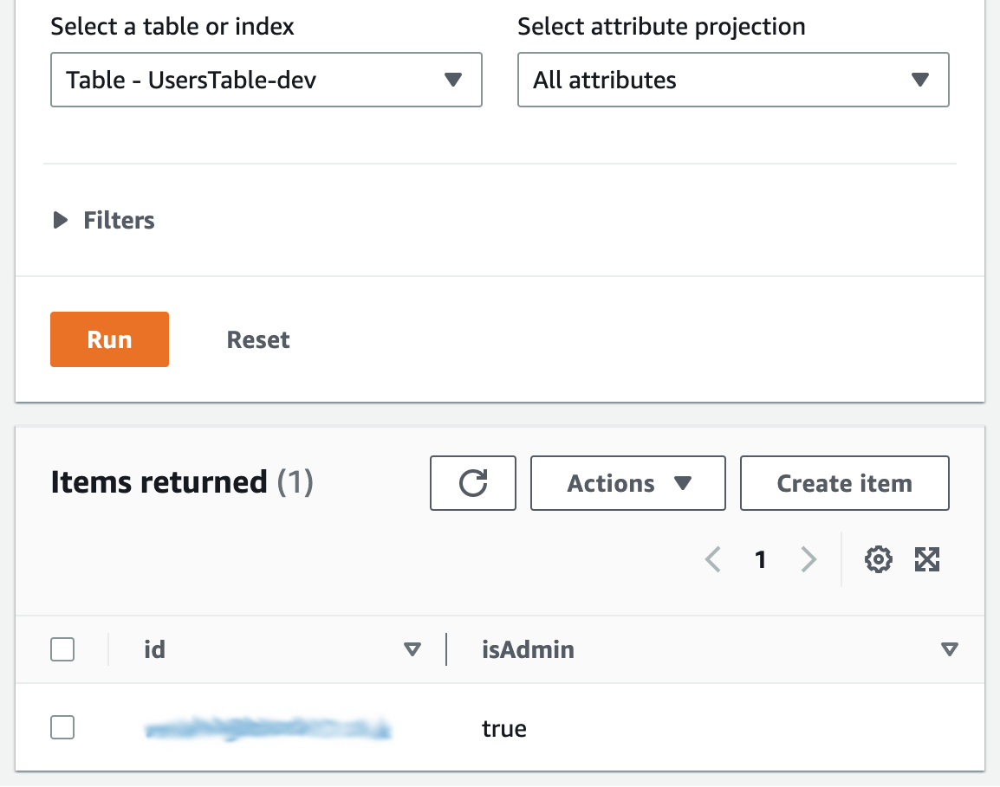

# Peer Reviews as a Service

Generate peer review responses. Accepts peer name, gender and review categores as input and returns personalised and gender respectful responses.

Includes CRUD endpoints for managing responses and a batch response creation endpoint for convenience. Uses AWS Cognito for admin user authentication for restricted endpoints.

Postman collection and environment included.

## Technologies used:

- [NodeJS](https://nodejs.org/en/)
- [Serverless Framework](https://www.serverless.com/framework/docs)
- [Middy Middleware](https://middy.js.org/)
- [AWS Cognito|DynamoDB|Lambda|CLI](https://aws.amazon.com/console/)
- [Postman](https://www.postman.com/)

### Installation & Setup

Checkout the repository and run `npm i` to install dependencies.

`serverless.yml` expects to find an [AWS profile](https://aws.amazon.com/premiumsupport/knowledge-center/create-access-key/) named `sls` so create this and configure the following (or remove the profile property from serverless.yml to use your default profile).

```bash
➜$ cat ~/.aws/config
[profile sls]
region = eu-west-1
output = yaml

➜$ cat ~/.aws/credentials
[sls]
aws_access_key_id = REDACTED
aws_secret_access_key = REDACTED
```

Deploy the service with `sls deploy --verbose`

All being well you will see the CloudFormation stack deployed and list of available endpoints output.

```bash
✔ Service deployed to stack praas-dev (77s)

endpoints:
  GET - https://API-GATEWAY-ID.execute-api.eu-west-1.amazonaws.com/dev/user/auth
  POST - https://API-GATEWAY-ID.execute-api.eu-west-1.amazonaws.com/dev/user/signup
  POST - https://API-GATEWAY-ID.execute-api.eu-west-1.amazonaws.com/dev/user/login
  POST - https://API-GATEWAY-ID.execute-api.eu-west-1.amazonaws.com/dev/review
  GET - https://API-GATEWAY-ID.execute-api.eu-west-1.amazonaws.com/dev/review
  PUT - https://API-GATEWAY-ID.execute-api.eu-west-1.amazonaws.com/dev/review
  DELETE - https://API-GATEWAY-ID.execute-api.eu-west-1.amazonaws.com/dev/review
  POST - https://API-GATEWAY-ID.execute-api.eu-west-1.amazonaws.com/dev/reviews
  GET - https://API-GATEWAY-ID.execute-api.eu-west-1.amazonaws.com/dev/reviews
  GET - https://API-GATEWAY-ID.execute-api.eu-west-1.amazonaws.com/dev/categories
  GET - https://API-GATEWAY-ID.execute-api.eu-west-1.amazonaws.com/dev/peer-review
```

Copy the base URL from one of the endpoints. Import the included Postman collection and environment and use the copied URL to configured the `host` environment variable.

Use the `POST` User Signup request to create a new user account. The email/validation code route is disabled to the account will automatically be confirmed and enabled in Cognito.

Use the AWS Console to promote the new user to Admin.



Use the `POST` User Login request to authenticate the user and generate a new access token. The test script behind the request will extract the token and set the environment variable for use in subsequent requests.

### Usage

To add a new review make a `POST` request to the `/review` endpoint containing a JSON body with the following structure.

```json
{
  "response": "|peer| manage|s| |pronoun-secondary| schedule well. |pronoun-primary| fully complete|s| all tasks assigned to |pronoun-ternary| for the week.",
  "categories": ["attendance", "punctuality"]
}
```

The `categories` property is an array of strings representing the character traits of the review response.

The `response` property will be returned when a review is requested for one of the given categories.

The replacement tags will be swapped for one of the following values based on the name and gender of the peer under review.

| Tag                 | Male                          | Female                        | Neutral                       |
| ------------------- | ----------------------------- | ----------------------------- | ----------------------------- |
| `peer` / `peer's`   | &lt;name\|pronoun primary&gt; | &lt;name\|pronoun primary&gt; | &lt;name\|pronoun primary&gt; |
| `pronoun primary`   | He                            | She                           | They                          |
| `pronoun secondary` | His                           | Her                           | Their                         |
| `pronoun ternary`   | Him                           | Her                           | Them                          |

Other non-pronoun replacements are

- `|is-are|` to properly output `He is` or `They are`
- `|has-have|` to output `She has` or `They have`
- `|s|` for verbs ending in 's' to output `He manages` or `They manage`
- `|es` for verbs ending in 'es' to output `She searches` or `They search`

A review can be retrieved by making a `GET` call to `/review?id=<id>`. This is a utility endpoint and has no programmatic use currently.

Make a `PUT` request to `/review?id=<id>` with the same body used to create a review, this will edit the review to have the updated properties.

To remove a review make a `DELETE` call to `/review?id=<id>`.

The utility endpoint `/reviews` can be used to `GET` all stored reviews. The output from this can be used as part of a backup/restore process. Making a `POST` request to the same endpoint allows the bulk insert of reviews, the JSON body should be an array of reviews.

TO generate a peer review make a `GET` request to `/peer-review?peer=<name>&gender=<male|female|neutral>&categories=<category CSV|ALL>&count=<responses per category>`

Example responses for each gender option:

```json
{
  "reviews": [
    {
      "category": "commitment",
      "text": "Alice is a perfectionist. She does not stop until she has produced excellent results."
    }
  ]
}
```

```json
{
  "reviews": [
    {
      "category": "commitment",
      "text": "Bob is self-motivated and strives to complete all his tasks on time."
    }
  ]
}
```

```json
{
  "reviews": [
    {
      "category": "commitment",
      "text": "Charlie has a high level of professional knowledge of their job."
    }
  ]
}
```
